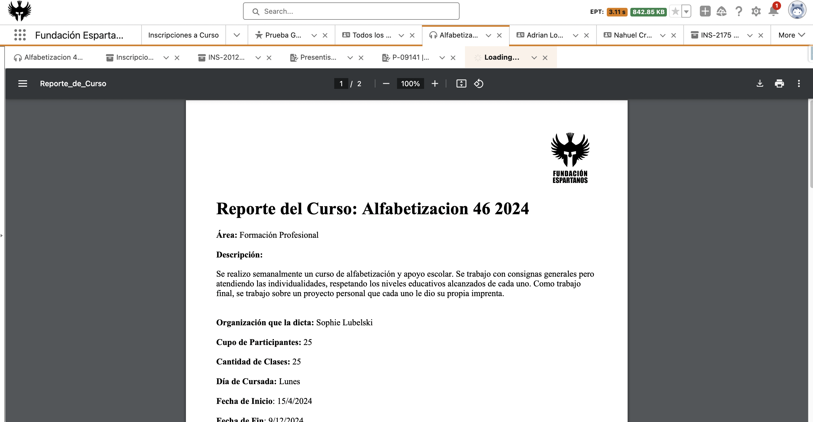

<div>
	
</div>

# _[Pro Bono - Fundación Espartanos](https://salesforce.benevity.org/cause/840-300108263/project/52Z22N14A3)_

#### Customer: _Fundación Espartanos_

#### Curso PDF Generator

<h4 align="center">
	<a href="#features">Features</a> |
	<a href="#getting-started">Getting Started</a> |
</h4>

<p align="center">
	
</p>

---

## Features

A button that will help creating a PDF for Cursos of the Foundation that dislays 

## Getting Started

_Add details about how someone can install the content of this repo in their org._


### Install


Deploy the source:

1. Clone this repository:

```
git clone https://github.com/gdedios/cursos-PDF-generator.git
cd cursos-PDF-generator
```

2. Authorize with your org and provide it with an alias (OrgAlias):

```
sfdx force:auth:web:login -a "OrgAlias"
```

3. Push the app to your org:

```
sfdx force:source:deploy --sourcepath force-app/main/default --json --loglevel fatal --targetusername "OrgAlias"
```

4. Open the default org:

```
sfdx force:org:open --targetusername "OrgAlias"
```

## Usage

Create a button to use the Visualforce Page and add that button to the Curso__c page layout

## FAQs

Contact gdedios@salesforce.com

#### Does it work in Communities?

> No

#### Does it work in Mobile?

> No

